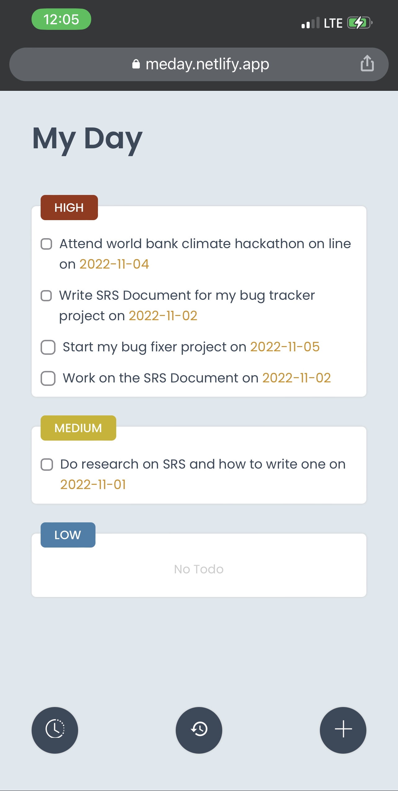

# My Day

My day app helps to keep track of my day to day activities and helps you to say organized by separating your task into Todo, Place to go, People to speak with

#### App Screenshot

<!-- 
### Live Demo
<a href="https://ishmaelkargbo.github.io/my-day">My Day</a> -->

## Built With

- Reat.js
- SCSS

## Getting Started

To get a local copy up and running follow these simple example steps.

- Clone this repository to your local machine
`git clone https://github.com/IshmaelKargbo/my-day.git`
- Go to the project filder
`cd my-day`
- Install the required dependency
`npm install` or `yarn install`
- Run the app on development server
`npm run serve` or `yarn serve`
- Build the production ready app
`npm run build` or `yarn build`

## Authors

👤 **Ishmael Kargbo**

- GitHub: [@githubhandle](https://github.com/ishmaelkargbo)
- Twitter: [@twitterhandle](https://twitter.com/ishodev)
- LinkedIn: [LinkedIn](https://www.linkedin.com/in/ishmael-kargbo-503660169)

## 🤝 Contributing

Contributions, issues, and feature requests are welcome!

Feel free to check the [issues page](https://github.com/IshmaelKargbo/my-day/issues).

## Show your support

Give a ⭐️ if you like this project!
